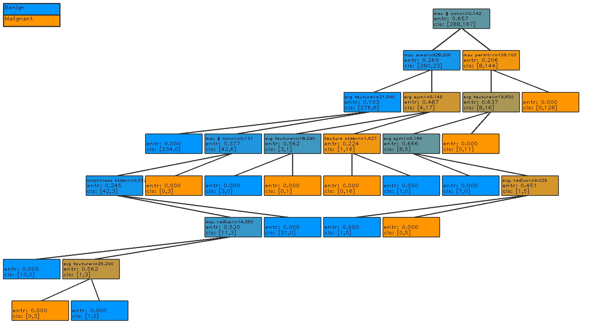

# decision-tree
This repository contains a simple and straightforward implementation of a decision tree classifier as described by Leo Breiman in Classification and Regression Trees. Included in the implementation are:
- gini and entropy impurity calculations
- optimal splitting function based on exhaustive search of splits and impurity metric
- pruning routine based on validation dataset accuracy
- custom tree plotting function using opencv 

